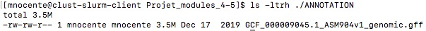

```{r setup, include=FALSE}
knitr::opts_chunk$set(echo = TRUE)
```

# Consignes et but du projet :

Nous devons faire une analyse simple de données de reséquençage d'un génome bactérien. Les données sont issues de cet article : "Complete Genome Sequences of 13 Bacillus subtilis Soil Isolates for Studying Secondary Metabolite Diversity" (doi:10.1128/MRA.01406-19).

Nous travaillons sur des données de whole genome sequencing (WGS).
Grâce à l'article, nous savons que les reads paired-end ont été générés sur un séquenceur Illumina NextSeq en utilisant le kit "TG NextSeq 500/550 high-output kit v. 2 (300 cycles)".


# Préparation du répertoire de travail:

Dans mon dossier "home", création d'un répertoire de travail, appelé "Projet_modules_4-5" et création d'une structure de répertoire pour le travail.

```{bash, eval=FALSE}
cd ~
mkdir -p ~/Projet_modules_4-5/FASTQ
mkdir -p ~/Projet_modules_4-5/GENOME_REFERENCE
mkdir -p ~/Projet_modules_4-5/ANNOTATION
mkdir -p ~/Projet_modules_4-5/CLEANING
mkdir -p ~/Projet_modules_4-5/MAPPING
mkdir -p ~/Projet_modules_4-5/QC
mkdir -p ~/Projet_modules_4-5/EXPLORATIONS_POST_MAPPING

cd ~/Projet_modules_4-5
ls -lh
tree ~/Projet_modules_4-5
 
```


# Téléchargement des données depuis les banques publiques:

## Téléchargement des fichiers fastq (read 1 et read 2) et compression des fichiers:
```{bash, eval=FALSE}
module load  sra-tools
srun fasterq-dump -S -p SRR10390685 --outdir ~/Projet_modules_4-5/FASTQ --threads 1

gzip ~/Projet_modules_4-5/FASTQ/*.fastq
ls -ltrh ~/Projet_modules_4-5/FASTQ

```


## Téléchargement du génome de référence et de l'annotation:

```{bash, eval=FALSE}
# Fichier gff:
cd ~/Projet_modules_4-5/ANNOTATION
srun wget https://ftp.ncbi.nlm.nih.gov/genomes/all/GCF/000/009/045/GCF_000009045.1_ASM904v1/GCF_000009045.1_ASM904v1_genomic.gff.gz 

# Fichier fasta:
cd ~/Projet_modules_4-5/GENOME_REFERENCE
srun wget https://ftp.ncbi.nlm.nih.gov/genomes/all/GCF/000/009/045/GCF_000009045.1_ASM904v1/GCF_000009045.1_ASM904v1_genomic.fna.gz

ls -ltrh ~/Projet_modules_4-5/ANNOTATION
ls -ltrh ~/Projet_modules_4-5/GENOME_REFERENCE

```


# Contrôle qualité des données brutes (reads):

## Lancement de l'outil fastqc pour réaliser le contrôle qualité des reads bruts:

```{bash, eval=FALSE}
cd ~/Projet_modules_4-5
module load fastqc
srun --cpus-per-task 8 fastqc FASTQ/SRR10390685_1.fastq.gz -o QC/ -t 8
srun --cpus-per-task 8 fastqc FASTQ/SRR10390685_2.fastq.gz -o QC/ -t 8

ls -ltrh ./QC
```


**Explication des paramètres utilisés :**

--cpus-per-task : nombre de cpu par tâche. 8 dans mon cas.

-o : le nom du répertoire de sortie des fichiers ayant été analysés par fastqc.

-t : nombre de threads. 8 dans mon cas.


## Récupération des fichiers fastqc au format html pour les visualiser en local sur ma machine:

scp mnocente@core.cluster.france-bioinformatique.fr:~/Projet_modules_4-5/QC/*_fastqc.html ./

## Analyse des résultats de fastqc:

### Rubrique "Basic Statistics":
Dans cette rubrique, on peut voir que les données ont été encodées par la méthode Sanger/Illumina 1.9. Il y a au total 7066055 reads 1 et reads 2. Aucun reads n'ont été flaggés pour une trop faible qualité et la taille des reads est entre 35 et 151 pb pour les reads 1 et 130 et 151 pb pour les reads 2. Le pourcentage en GC des reads 1 et 2 est de 43%.
D'après la taille des reads, on peut penser que les données ont déjà été nettoyées par la plateforme de séquençage.


### Rubrique "Per base sequence quality":
Dans cette rubrique du rapport de fastqc, on peut voir que la qualité des bases des reads est bonne car les quantiles (boites jaunes) sont tous présents dans la partie de haute qualité à la fois pour les reads 1 et 2.


Cependant, on remarque équalement qu'il y a une diminution de la qualité des reads pour les dernières bases, ce qui est classique dans un séquençage Illumina. Cela est plus marqué pour les reads 2. Cette diminution de la qualité du séquençage en fin de read est expliquée par les limitations de la chimie.


### Autres rubriques : "Per sequence GC content", "Per sequence quality scores" et "Per base N content": 

Concernant les autres rubriques du rapport fastqc, les scores de qualité (Q-scores) par séquence pour les reads 1 et 2 sont très bons, ainsi que le contenu en GC des séquences et le contenu en N par base.
Le pourcentage en GC peut révéler une contamination si il y a plusieurs pics, ce n'est pas le cas ici.
En séquençage Illumina, il n'y a classiquement pas de N, sauf si il y a un gros problème de séquençage, ce qui n'est pas le cas ici.

On peut voir ci-dessous ces rubriques pour les reads 1:


### Rubrique "Per base sequence content":

On remarque dans cette rubrique qu'il y a, pour les reads R1 et R2, une variation, un biai, dans le contenu en base au niveau des 10ères bases ainsi qu'à la fin des reads. Cela n'est pas inquiétant, c'est caractéristique d'un séquençage Illumina. Cela arrive au démarrage du séquençage.


### Rubrique "Sequence duplication levels":

On remarque, pour les reads R1 et R2, que le niveau de duplication des séquences est un peu élevé.
Cela peut indiquer qu'il y a eu une trop forte amplification de l'ADN ou bien que les reads ont été séquencés avec une très grande profondeur et dans ce cas, c'est normal d'avoir des duplicats.


### Rubrique "Sequence length distribution":

Cette rubrique représente la distribution des longueurs des séquences. La distribution révèle qu'il y a une très grande majorité de reads qui ont une taille entre 140 et 155 pb pour les reads R1 et entre 148 et 152 pb pour les reads R2.


### Rubrique "Overrepresented sequences" et "Adapter content":

Enfin, concernant ces deux rubriques, fastqc signale une séquence surreprésentée dans les reads R1 et une autre dans les reads R2.
Il s'agit en fait de bases qui ne peuvent pas être lues par le séquenceur (ou qu'il n'a pas su déterminer de quelle base il s'agissait). Voir la documentation (il n'y a que 2 couleurs utilisées pour la détection des bases sur le NextSeq): https://sequencing.qcfail.com/articles/illumina-2-colour-chemistry-can-overcall-high-confidence-g-bases/.

On remarque également une légère contamination en adaptateurs universels Illumina sur les reads R2. Ils seront enlevés lors du trimming.


## Calcul de la profondeur de séquençage :
- Quelle est la profondeur de séquençage (calculée par rapport à la taille du génome de référence) ?

### Calcul du nombre de bases dans le génome de référence:
```{bash, eval=FALSE}
cd ~/Projet_modules_4-5
module load samtools
gunzip ./GENOME_REFERENCE/GCF_000009045.1_ASM904v1_genomic.fna.gz

srun samtools faidx ./GENOME_REFERENCE/GCF_000009045.1_ASM904v1_genomic.fna
less ./GENOME_REFERENCE/GCF_000009045.1_ASM904v1_genomic.fna.fai

gzip ./GENOME_REFERENCE/GCF_000009045.1_ASM904v1_genomic.fna
```

Il y a 4215606 bases dans le génome de référence des 13 souches de *B. subtilis*.

D'après le rapport de fastqc, il y a 7066055 reads forward et reverse et il s'agit d'un séquençage de reads de 2 × 150 pb environ.  

La profondeur de séquençage est donc de : Profondeur = (taille moyenne des reads x nombre de reads) / taille du génome de référence.
```{r}
(2*150*7066055)/(4215606)

```
Profondeur de séquençage d'environ 503X.

La très grande profondeur de séquençage peut expliquer le niveau de duplication assez élevé.


# Nettoyage des reads :

Pour nettoyer les reads, je choisis d'utiliser l'outil fastp car c'est un outil "tout-en-un", très rapide et qui retire par défaut les adaptateurs.
Je choisis de ne pas imposer une longueur de reads, mais de fixer une taille minimale de reads qui est de 100 pb. Je fais le choix d'être moyennement stringeante concernant la taille des reads. On a vu dans le rapport fastqc que la très grande majorité des reads ont une longueur d'au moins 140 pb.

Je choisis également de ne pas couper la fin des reads, afin ne pas perdre trop de reads. Même si la qualité des bases est un peu moins bonne sur la fin, la qualité est correcte, on a vu que les quartiles sont dans les hautes qualités (y compris à la fin).
Le trimming des adaptateurs est actif par defaut.

```{bash, eval=FALSE}
module load fastp
cd ~/Projet_modules_4-5
srun --cpus-per-task 8 fastp \
 --in1 FASTQ/SRR10390685_1.fastq.gz \
 --in2 FASTQ/SRR10390685_2.fastq.gz \
 --out1 CLEANING/SRR10390685_1.cleaned_filtered.fastq.gz \
 --out2 CLEANING/SRR10390685_2.cleaned_filtered.fastq.gz \
 --unpaired1 CLEANING/SRR10390685_singles.fastq.gz \
 --unpaired2 CLEANING/SRR10390685_singles.fastq.gz \
 --failed_out CLEANING/SRR10390685_failed_out.txt \
 --length_required 100 \
 -w 1 \
 -j CLEANING/fastp.json \
 -h CLEANING/fastp.html
 
ls -ltrh ~/Projet_modules_4-5/CLEANING/
```


**Explication des paramètres :**

--cpus-per-task : nombre de cpu aloués a fastp

--in1 : fichier input 1 = fastq read 1

--in2 : fichier input 2 = fastq read 2

--out1 : fichier output read 1 nettoye et filtre

--out2 : fichier output read 2 nettoye et filtre

--unpaired1 : pour l input PE(paired-end), si read1 a passé QC mais pas read2, il sera écrit dans unpaired1

-unpaired2 : pour l input PE(paired-end), si read2 a passé QC mais pas read1, il sera écrit dans unpaired2

--failed_out : specifie le fichier pour stocker les reads qui n ont pas passé les filtres

--length_required : les reads doivent avoir une taille d'au moins 100 pb

-w : nombre de threads travaillant

-j : rapport de fastp au format .json

-h : rapport de fastp au format .html


## Visualisation du rapport de fastp:


**Analyse des résultats après trimming:**

Après filtration, on récupère 97,12 % des reads. C'est à dire que tous ces reads ont satisfait les filtres et n'ont pas été supprimés.
2,59% des reads ont été supprimés à cause d'une trop faible qualité, 0,03% des reads ont été supprimés à cause d'un trop fort contenu en bases "N", et 0,26 % read ont été supprimés car ils étaient trop courts (inférieurs à mon seuil de 100 pb).

## Comparaison avec d'autres tailles minimales de reads:

J'ai choisi d'utiliser fastp avec comme paramètre --length_required 100, mais je souhaitais voir ce que cela changeait dans la filtration des données, de choisir --length_required 30, 70 ou 130.

Voici les résultats ci-dessous résumés dans un tableau:

| choix du paramètre --length_required |  reads ayant passés les filtres  | reads supprimés à cause d'une trop faible qualité | reads supprimés à cause d'un trop fort contenu en bases "N" | reads trop courts |
|---    |:-:    |:-:    |:-:    |:-:    |
|   30    |  97,38 %    |  2,59 %  |  0,03 %    |    0 %   |
|   70    |  97,34 %    |  2,59 %  |  0,03 %    |   0,04 % |
|   100   |  97,12 %    |  2,59 %  |  0,03 %    |   0,26 % |
|   130   |  95,66 %    |  2,59 %  |  0,03 %    |   1,72 % |

On observe que, quelque soit la taille minimale des reads choisie, il y a toujours le même nombre de reads supprimés à cause d'une trop faible qualité ou d'un trop fort contenu en bases "N". Comme attendu, la seule chose qui change est le nombre de reads supprimés car ils sont trop courts. On peut donc conclure que 99,74 % des reads ont une taille d'au moins 100 pb. D'après le rapport de fastqc, on sait que les reads supprimés car trop courts sont tous des reads R1.
Afin de ne pas perdre trop de reads R1, ni de garder trop de petits reads, j'ai choisi de continuer l'analyse avec les données trimmées avec l'option --length_required 100.


# Vérification de la qualité des reads après nettoyage:

```{bash, eval=FALSE}
cd ~/Projet_modules_4-5
module load fastqc
srun --cpus-per-task 8 fastqc CLEANING/SRR10390685_1.cleaned_filtered.fastq.gz -o QC/ -t 8
srun --cpus-per-task 8 fastqc CLEANING/SRR10390685_2.cleaned_filtered.fastq.gz -o QC/ -t 8

ls -ltrh ./QC
```


## Récupération des fichiers fastqc au format html pour les visualiser en local sur ma machine:

scp mnocente@core.cluster.france-bioinformatique.fr:~/Projet_modules_4-5/QC/*.cleaned_filtered_fastqc.html ./


## Analyse des résultats de fastqc après trimming :

On remarque que les séquences surreprésentées (avec que des N) ont bien été supprimées (mais pas celles avec que des G). La légère contamination en adaptateurs universels Illumina sur les reads R2 a bien été supprimée.


## Rapport regroupant les résultats de fastqc et fastp: utilisation de l'outil MultiQC:

```{bash, eval=FALSE}
cd ~/Projet_modules_4-5
module load multiqc
srun multiqc ./FASTQ ./QC ./CLEANING -o CLEANING -n multiqc_report

ls -ltrh ./CLEANING/
```


Ce rapport fournit un résumé de ce que l'on sait et de ce que l'on a fait sur nos deux fichiers fastq.


# Alignement des reads contre le génome de reférence

```{bash, eval=FALSE}
cd ~/Projet_modules_4-5
module load bwa
module load samtools

# Creation de l'index du genome
srun bwa index ./GENOME_REFERENCE/GCF_000009045.1_ASM904v1_genomic.fna.gz
ls -ltrh ./GENOME_REFERENCE

# Mapping
srun --cpus-per-task=33 bwa mem \
  ./GENOME_REFERENCE/GCF_000009045.1_ASM904v1_genomic.fna.gz \
  CLEANING/SRR10390685_1.cleaned_filtered.fastq.gz \
  CLEANING/SRR10390685_2.cleaned_filtered.fastq.gz \
  -t 32 \
  2> MAPPING/SRR10390685_log.txt \
|\
samtools view -hbS > MAPPING/SRR10390685.bam

ls -ltrh ./MAPPING
```


J'ai choisi d'utiliser l'outil bwa-mem pour aligner mes reads sur le génome de référence car c'est un aligneur qui a de bonnes performances pour aligner les "petits" reads (de 70 à 1000 pb) sur leur génome de référence. BWA-MEM est en général rapide et précis. 
Référence : http://bio-bwa.sourceforge.net/bwa.shtml.


**Explication des paramètres utilisés pour bwa mem :**

-t : nombre de threads

--cpus-per-task : nombre de cpu par tâche

**Explication des paramètres utilisés pour samtools view :**

-h : inclue le header dans le fichier output.

-b : le format du fichier de sortie est le bam.

-S : Ignoré pour la compatibilité avec les versions précédentes de samtools. Auparavant, cette option était requise si le fichier d'entrée était au format SAM, mais maintenant le format correct est automatiquement détecté en examinant les premiers caractères de l'entrée.


## Quel est le pourcentage de reads pairés alignés ?

```{bash, eval=FALSE}
module load samtools
cd ~/Projet_modules_4-5
srun samtools flagstat MAPPING/SRR10390685.bam > MAPPING/SRR10390685_flagstat.txt

ls -ltrh ./MAPPING

```


**Résultats du samtools flagstat :**

```{bash, eval=FALSE}
less ./MAPPING/SRR10390685_flagstat.txt

```


Grâce à cet outil, on a accès à différentes informations sur le mapping de nos échantillons :

- total : nombre total de reads (somme des reads forward, reverse, single et supplémentaires).

- supplementary : nombre de fois où un read chimerique a mappé à plusieurs endroits.

- mapped : nombre de reads qui ont mappé sur les contigs et pourcentage mappés sur le total.

- paired in sequence : somme des reads 1 et 2

- properly paired : nombre de reads forward et reverse qui ont mappés sur les même contigs orientés l'un vers l'autre.

- with itself and mate mapped : nombre de reads appariés où les deux sont mappés.

- singletons : nombre de reads appariés où l'un est mappé et pas l'autre.


On peut voir que 94,52% des reads ont été mappés (ces reads ont tous passés les analyses de contrôle qualité "QC").
Il y a 94,06% des reads qui ont été mappés "proprement", c'est-à-dire qu'ils ont mappés sur les même contigs orientés l'un vers l'autre et 0,29% de singletons, c'est-à-dire qu'un deux reads appariés n'a pas mappé.


# Extraction dans un fichier BAM des reads chevauchant à au moins 50% le gène trmNF:

## On décompresse le fichier d'annotation:
```{bash, eval=FALSE}
cd ~/Projet_modules_4-5

gunzip ./ANNOTATION/GCF_000009045.1_ASM904v1_genomic.gff.gz
ls -ltrh ./ANNOTATION

```




## On vérifie que le gène trmNF est bien dans le fichier d'annotation et création d'un gff ne contenant que le gène d'intérêt :
```{bash, eval=FALSE}
cd ~/Projet_modules_4-5

srun grep -ni "trmNF" ./ANNOTATION/GCF_000009045.1_ASM904v1_genomic.gff | awk '$3=="gene"' > ./EXPLORATIONS_POST_MAPPING/trmNF_gene.gff

ls -ltrh ./EXPLORATIONS_POST_MAPPING
cat ./EXPLORATIONS_POST_MAPPING/trmNF_gene.gff
```


## Extraction des reads chevauchant à au moins 50% le gène trmNF avec bedtools intersect:

```{bash, eval=FALSE}
cd ~/Projet_modules_4-5
module load bedtools

srun bedtools intersect -abam ./MAPPING/SRR10390685.bam -b ./EXPLORATIONS_POST_MAPPING/trmNF_gene.gff -f 0.50 > ./EXPLORATIONS_POST_MAPPING/reads_chevauchant_minimum_50pourc_gene_trmNF.bam

ls -ltrh ./EXPLORATIONS_POST_MAPPING
```

**Explication des paramètres utilisés:**

-abam: Le fichier A est un fichier BAM.

-b : Le fichier B est ici un GFF.

-f : Par défaut, bedtools intersect signalent un chevauchement entre A et B tant qu'il y a au moins une paire de bases qui se chevauche. Or, ici on veut trouver les reads dont au moins 50% de leur longueur est alignée sur le gène trmNF. L'option -f 0.50 permet de définir le chauvauchement minimum (50% dans notre cas) que nous voulons avoir pour les fractions de A.


# Version des outils utilisés dans ce projet :

```{bash, eval=FALSE}
fastqc --version
fastp --version
samtools --version
bedtools --version
multiqc --version
bwa
```


**La version des outils est donc :**

FastQC v0.11.9

fastp 0.20.0

multiqc 1.9

bwa 0.7.17-r1188

samtools 1.10 (Using htslib 1.10.2)

bedtools v2.29.2

sra-tools 2.10.3


# Affichage de l'arborescence finale des répertoires :

```{bash, eval=FALSE}
cd ~/Projet_modules_4-5
tree ~/Projet_modules_4-5
```


